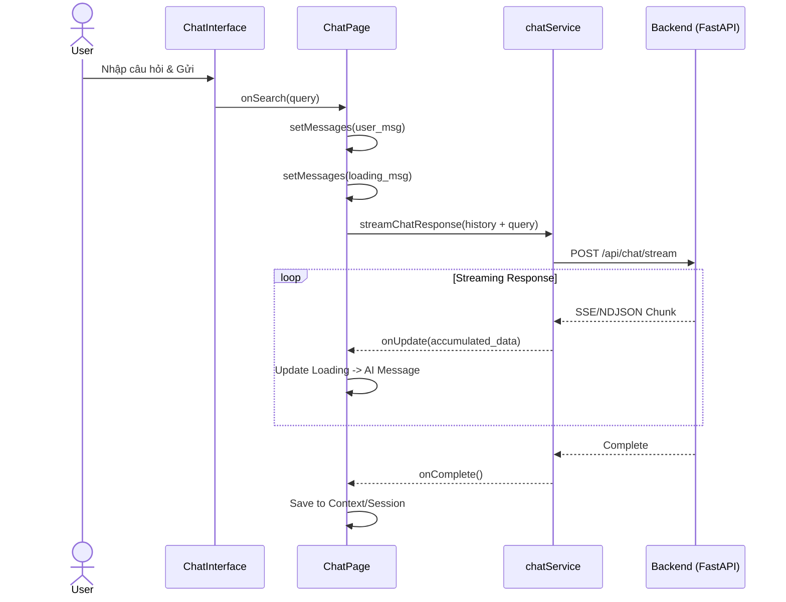

# Đặc tả Yêu cầu Phần mềm (SRS) 01: Giao diện Chat & Hệ thống Agent

## Phần 1: Tổng quan & Thiết kế (Overview & Design)

### 1.1 Mục đích
Cung cấp giao diện tương tác chính cho nền tảng Adecos, nơi người dùng (Marketer/Researcher) giao tiếp với hệ thống AI đa tác nhân để thực hiện nghiên cứu thị trường, phân tích dữ liệu quảng cáo và tạo chiến dịch.

### 1.2 Thiết kế Giao diện (UI/UX)
Dựa trên quan sát thực tế và mã nguồn (`index.css`, `ChatInterface.jsx`):

*   **Chủ đề & Màu sắc**:
    *   Hỗ trợ **Dark Mode** (mặc định) và Light Mode.
    *   **Màu nền**: `luxury-black` (#0a0a0a) cho nền chính, `luxury-charcoal` (#171717) cho sidebar.
    *   **Font chữ**: Tiêu đề dùng **Serif** (`Playfair Display`) tạo cảm giác cao cấp/tin cậy; Nội dung dùng **Sans-serif** (`Inter`) để dễ đọc dữ liệu.
    *   **Hiệu ứng**: Sử dụng Glassmorphism (nền mờ, viền bán trong suốt) cho các thẻ và bong bóng chat. Container chính có hiệu ứng *Blue Glow* tinh tế bao quanh.

*   **Bố cục (Layout)**:
    *   **Sidebar trái**: Điều hướng cố định, chứa logo "Adecos" và menu chức năng.
    *   **Khu vực Chính (Main Workspace)**:
        *   **Header**: Tiêu đề "AI Agent" và phụ đề "Powered by Gemini AI".
        *   **Khu vực Tin nhắn**: Chiếm phần lớn diện tích, cuộn dọc tự động (`useAutoScroll`). Tin nhắn cũ (>20) được ẩn tự động để tối ưu hiệu năng.
        *   **Input Bar (ChatInterface)**: Cố định dưới đáy.
            *   Trạng thái chờ: Nằm giữa màn hình với logo lớn và gợi ý (Suggestions).
            *   Trạng thái hoạt động: Thu gọn xuống đáy, bo tròn, hiệu ứng chuyển cảnh mượt mà (`transition-all duration-1000`).

### 1.3 Luồng Người dùng (User Flow)
1.  **Khởi đầu**: Người dùng thấy màn hình chào với các gợi ý ("Tối ưu chiến dịch ads", "Chi phí tháng này"...).
2.  **Tương tác**: Nhập câu hỏi hoặc chọn gợi ý.
3.  **Xử lý**: 
    *   Tin nhắn người dùng hiện ngay lập tức (bên phải).
    *   AI hiện trạng thái "Adecos đang phân tích..." (loading animate).
4.  **Phản hồi**: Kết quả được stream (hiện dần) dưới dạng văn bản, bảng, hoặc biểu đồ tương tác.
5.  **Hành động tiếp theo**: Người dùng có thể click vào các nút hành động (Action Links) hoặc yêu cầu "Deep Dive" từ các bảng dữ liệu.

---

## Phần 2: Kiến trúc Kỹ thuật (Technical Architecture)

### 2.1 Sơ đồ Thành phần (Component Diagram)
Mô hình dưới đây minh họa mối quan hệ giữa các React Component trong trang Chat.

```mermaid
graph TD
    Page[ChatPage] --> Context[ChatContext]
    Page --> Interface[ChatInterface]
    Page --> List[Message List]
    List --> MsgItem[ChatMessage]
    
    subgraph "ChatMessage Variants (Dispatcher)"
        MsgItem --> Text[ReactMarkdown (Text)]
        MsgItem --> Tbl[ResultsTable (Table)]
        MsgItem --> Chart[ChartMessage (Chart)]
        MsgItem --> Comp[CompositeMessage]
        MsgItem --> Workflow[CompactWorkflowMessage]
        MsgItem --> Loading[Loading State]
    end

    Context -.-> Storage[(SessionStorage)]
    Interface -->|onSubmit| Page
```

### 2.2 Sơ đồ Luồng Dữ liệu (Sequence Diagram)
Quy trình xử lý một tin nhắn từ người dùng bắt đầu đến khi AI trả lời hoàn tất.



### 2.3 Frontend Architecture
*   **Page Component**: `ChatPage.jsx`
    *   Quản lý trạng thái UI: `isSearching`, `visibleMessages`.
    *   Tích hợp Hooks: `useOnboarding` (demo flow), `useAutoScroll`.
*   **State Management**: `ChatContext.jsx`
    *   Lưu trữ lịch sử chat (`messages`) trong `sessionStorage` để duy trì ngữ cảnh khi reload trang (trừ loading state).
    *   Cung cấp hàm `getHistory()` cho việc gửi context lên backend.

### 2.4 Backend Logic & API
*   **Legacy Endpoint**: `POST /api/chat/stream` (Xử lý đơn giản)
    *   Sử dụng `classify_intent_ai` để phân loại: `research`, `explanation`, `followup`.
    *   Trả về JSON chunk: `{ type: "table" | "text", content: ... }`.
*   **Agent Endpoint (New)**: `POST /api/agent/chat` (Xử lý phức tạp)
    *   Sử dụng **CrewAI** hoặc quy trình đa bước (Router -> Analyst -> Narrator).
    *   Trả về các loại dữ liệu phức tạp hơn: `composite`, `chart`, `workflow`.

### 2.5 Mô hình Dữ liệu Tin nhắn (Message Data Model)
Mỗi tin nhắn trong danh sách `messages` có cấu trúc:
```json
{
  "role": "user" | "assistant",
  "type": "text" | "table" | "chart" | "composite" | "workflow" | "loading",
  "content": "String hoặc JSON Object/Array",
  "context": "Metadata bổ sung (tùy chọn)",
  "actions": [{ "label": "Xem chi tiết", "navigate": "/ads" }]
}
```

---

## Phần 3: Danh mục Thành phần (Component Reference)

Hệ thống sử dụng component `ChatMessage.jsx` làm bộ điều phối (dispatcher) để hiển thị các loại nội dung khác nhau. Dưới đây là các component con được sử dụng:

### 3.1 Thành phần Tương tác & Hiển thị
1.  **`ChatInterface.jsx`**:
    *   Thanh nhập liệu thông minh.
    *   Xử lý hiệu ứng chuyển đổi từ "Home View" sang "Chat View".
    *   Hiển thị Chips gợi ý (Suggestions).

2.  **`ResultsTable.jsx`** (Type: `table`):
    *   Hiển thị dữ liệu dạng bảng (ví dụ: danh sách Affiliate Programs).
    *   Cột nhận diện thông minh (Brand, Commission, Score).

3.  **`ReactMarkdown`** (Type: `text`):
    *   Render văn bản AI với định dạng custom (Article style).
    *   Hỗ trợ, list, code block, blockquote.

### 3.2 Thành phần Agent & Nâng cao
4.  **`CompositeMessage.jsx`** (Type: `composite`):
    *   Kết hợp văn bản tường thuật (Narrative) + Biểu đồ/Bảng trong một khối tin nhắn.

5.  **`ChartMessage.jsx`** (Type: `chart`):
    *   Vẽ biểu đồ (Bar, Line, Pie) sử dụng thư viện `recharts`.
    *   Dữ liệu cấu hình động từ AI.

6.  **`ResearchProgressMessage.jsx`** (Type: `deep_research_progress`):
    *   Hiển thị thanh tiến trình và các bước đang thực hiện của tác vụ Deep Research.

7.  **`CampaignSelectionTable.jsx`** (Type: `campaign_selection`):
    *   Bảng chuyên biệt để chọn chiến dịch quảng cáo cần phân tích.
    *   Có sự kiện `onSelect` kích hoạt flow Deep Dive.

8.  **`CompactWorkflowMessage.jsx`** (Type: `workflow`):
    *   Hiển thị quy trình làm việc dạng rút gọn (SMART layout).

9.  **`FeaturePreviewCard.jsx` / `InteractiveFeatureReveal.jsx`**:
    *   Các thẻ UI đặc biệt để giới thiệu tính năng mới hoặc ẩn/hiện nội dung tương tác.

### 3.3 Thành phần Khác
*   **`CommunityCard`**: Thẻ kêu gọi tham gia cộng đồng.
*   **`EmailCaptureMessage`**: Form thu thập email (Lead Gen).
*   **`DeepResearchStatus`**: Component toàn cục (Global) hiển thị trạng thái nghiên cứu bên ngoài khung chat (nằm ở Sidebar/Overlay).

## Phần 4: Yêu cầu Phi Chức năng
*   **Hiệu năng**: Chatbox phải phản hồi thao tác gõ phím tức thì. Stream AI phải mượt mà (chunk update).
*   **Scrolling**: Phải tự động cuộn xuống tin nhắn mới nhất nhưng không làm phiền khi người dùng đang xem nội dung cũ (`useAutoScroll` logic).
*   **Persistency**: Lịch sử chat được lưu phiên (Session) nhưng xóa khi reload nếu cần (nút Restart Onboarding).
